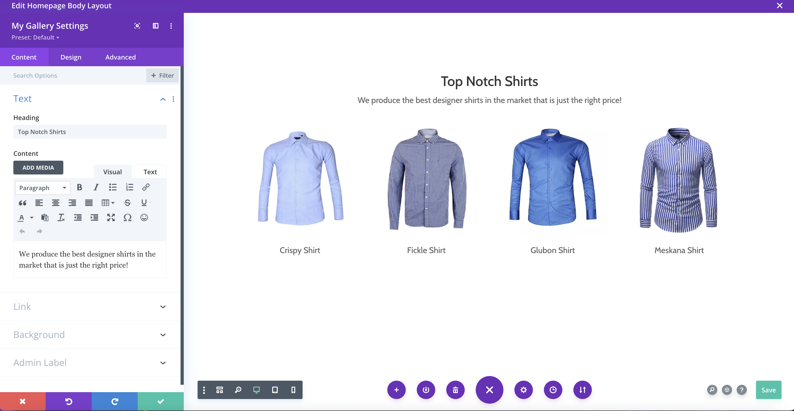

# My Gallery

## Description

A simple Divi module called <strong>My Gallery</strong> to help you showcase pictures saved into a custom post type called <strong>Gallery</strong>. 

This module assumes you've got WordPress and the Divi theme set up. You'll also need a plugin like CPT UI set up which you can use to create the custom post type called <strong>Gallery</strong>. You can also use any other plugin of your choice to create the <strong>Gallery</strong> custom post type.

## Requirements

- WordPress 5.0+
- CPT UI (WordPress Plugin)
- Divi Theme

## Screenshot

## Todo

- Image Title (shown underneath image) on Overlay
- Cancel button on top right of Overlay
- Changed dynamic URL used on React components
- Add Drop down list box (Select box) to display post types (gallery, post, page)